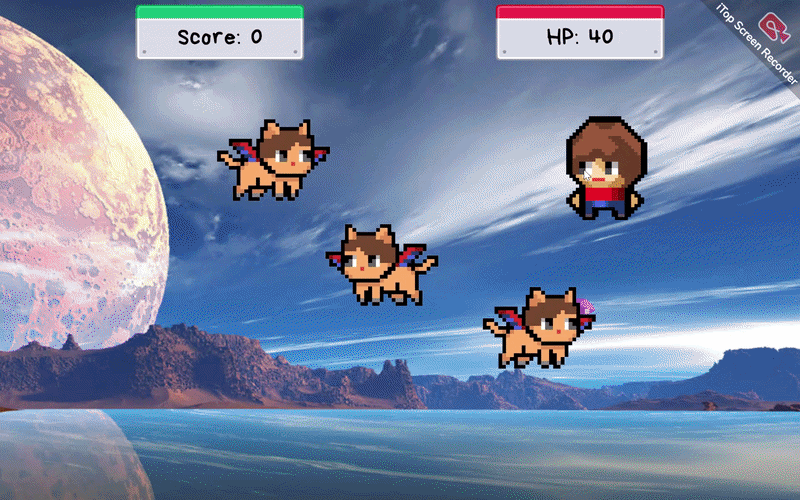
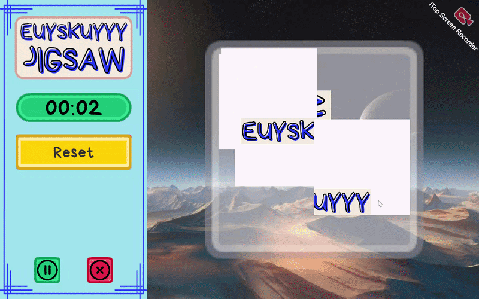
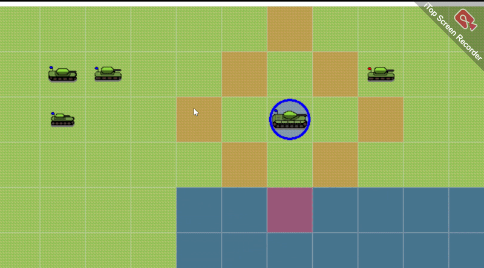

# Hi, I'm Nathanael Noah Purwoadi! 👋
**Handles EUYSKUYYY on itch.io**

---

### 🚀 Featured Projects

| **Chimmy Collect Crystal (2026)** | **Euyskuyyy Jigsaw (2026)** |
| :--- | :--- |
|  |  |
| Chimmy Collect Crystal a remade Scratch game in Unity where you collect crystals and avoiding flying cats for some reason. Features a new mode with items, leaderboard, and some improvements. | Euyskuyyy Jigsaw isn't your usual jigsaw- it has animated moving objects that's somewhat challenging. Features grid size and object speed options, records, and a custom pack editor where you can insert your own images inside. |
| 🔗 [Play on itch.io](https://euyskuyyy.itch.io/chimmy-collect-crystal) · [Repository here](https://github.com/n04heuyyy/chimmy_collect_crystal) | 🔗 [Play on itch.io](https://euyskuyyy.itch.io/euyskuyyy-jigsaw) · [Repository here](https://github.com/n04heuyyy/euyskuyyy_jigsaw) |

| **This game is still processing (WIP)** | **Euyskuyyy Battlefield (WIP)** |
| :--- | :--- |
|  |  |
| This game is still processing... (Preview is just placeholder) | Euyskuyyy Battlefield is a customized WW2-themed 2D turn-based strategy game where you command units to victory. Features many different units from different factions, skirmish maps, and a bot AI to play with. |
| 🔗 [Play on itch.io](#) · [Repository here](#) | 🔗 [Play on itch.io](#) · [Repository here](https://github.com/n04heuyyy/euyskuyyy_battlefield) |

**About Me: Game Developer (Specializion: Game Design & Programming)**

I can solo-develop games but mainly specialized in designing games and programming them in Unity. Interested in trying out different game engines and applying some quirky ideas. With the rise of AI nowadays, I usually use some AI for game vibe coding, but everything else are done original style.

---
