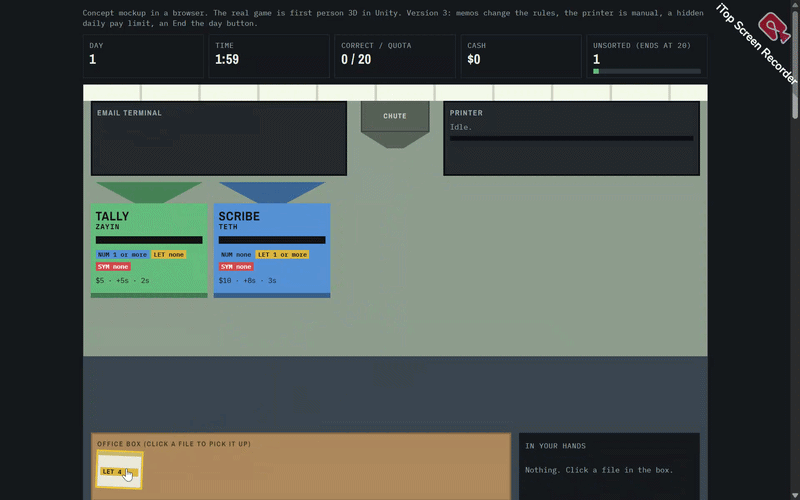

# Hi, I'm Nathanael Noah Purwoadi! 👋
**Handles EUYSKUYYY on itch.io**

---

### 🚀 Featured Projects

<table width="100%">
  <tr>
    <td width="50%" valign="top">
      
        
      <b>Chimmy Collect Crystal</b> 
      Chimmy Collect Crystal a remade Scratch game in Unity where you collect crystals and avoiding flying cats for some reason. Features a new mode with items, leaderboard, and some improvements. 
      🔗 <a href="https://euyskuyyy.itch.io/chimmy-collect-crystal">Play on itch.io</a> · <a href="https://github.com/n04heuyyy/chimmy_collect_crystal">Repository</a>
    </td>
    <td width="50%" valign="top">
      
        
      <b>Euyskuyyy Jigsaw</b> 
      Euyskuyyy Jigsaw isn't your usual jigsaw- it has animated moving objects that's somewhat challenging. Features grid size and object speed options, records, and a custom pack editor where you can insert your own images inside. 
      🔗 <a href="https://euyskuyyy.itch.io/euyskuyyy-jigsaw">Play on itch.io</a> · <a href="https://github.com/n04heuyyy/euyskuyyy_jigsaw">Repository</a>
    </td>
  </tr>
  <tr>
    <td width="50%" valign="top">
      
        
      <b>nine-five (WIP)</b> 
      nine-five is a serious file sorting game where you sort oncoming files in your office. Features items and upgrades to help you, and increasingly challenging mechanics as new days pass. The preview is an AI mockup, not the real game yet, it's still WIP. 
      🔗 <a href="https://euyskuyyy.itch.io/nine-five">Play on itch.io</a> · <a href="https://github.com/n04heuyyy/nine-five">Repository</a>
    </td>
    <td width="50%" valign="top">
      
        
      <b>Euyskuyyy Battlefield</b> 
      Euyskuyyy Battlefield is a customized WW2-themed 2D turn-based strategy game where you command units to victory. Features many different units from different factions, skirmish maps, and a bot AI to play with. 
      🔗 <a href="#">Play on itch.io</a> · <a href="https://github.com/n04heuyyy/euyskuyyy_battlefield">Repository</a>
    </td>
  </tr>
</table>

**About Me: Game Developer (Specializion: Game Design & Programming)**

I can solo-develop games but mainly specialized in designing games and programming them in Unity. Interested in trying out different game engines and applying some quirky ideas. With the rise of AI nowadays, I usually use some AI for game vibe coding, but everything else are done original style.

---
